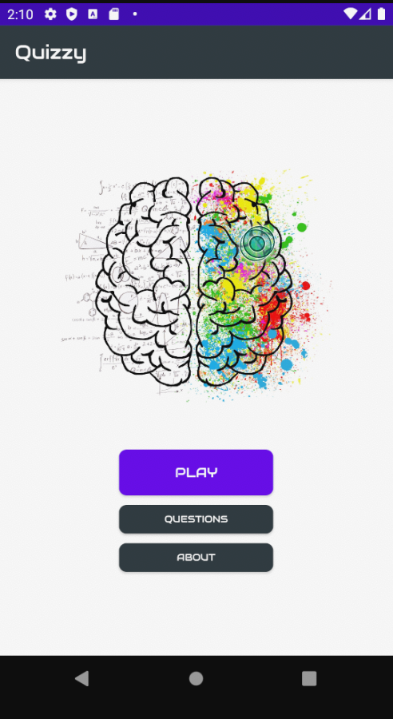
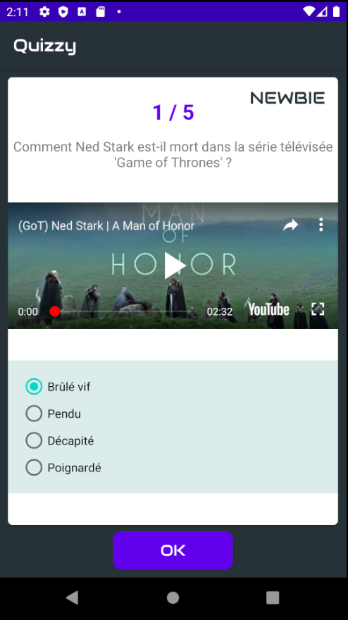
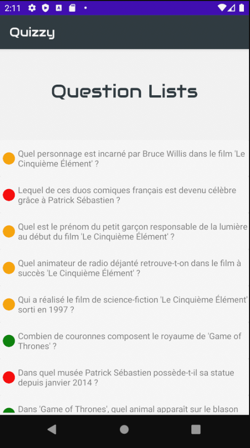

# kotlin_quizzy

Simple Quizz App

## BlackLog

* [Link](https://trello.com/b/RSWPOgEV/android-flash-card)

## Getting Started

Be sure to have an Android emulator and a network connection

### Installing

Sync your dependencies !

## Deployment

Just run the app on your emulator

  

## Built With

* [Kotlin](https://kotlinlang.org/)
* [Android Studio](https://developer.android.com/studio)

## Versioning

1.0

## Authors

* **Florian Gustin @Flow2dot0** - [Linkedin](https://www.linkedin.com/in/florian-gustin/)
* **Ben Grandin @BenGrandin** - [Linkedin](https://www.linkedin.com/in/bengrandin/)